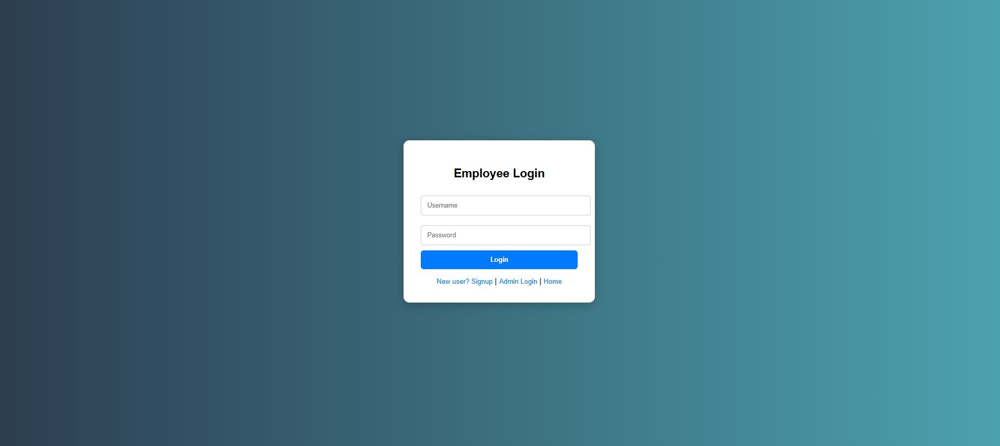
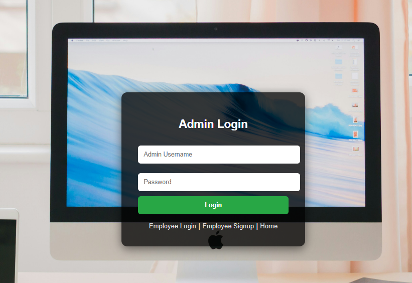
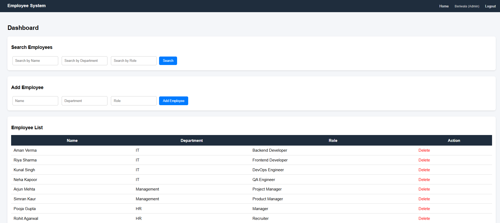
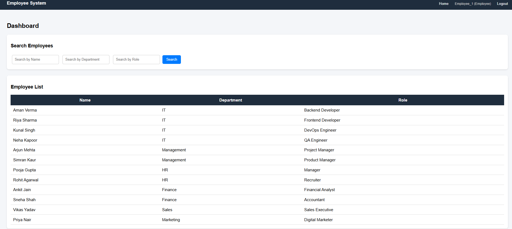
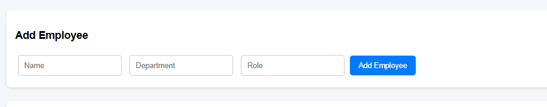
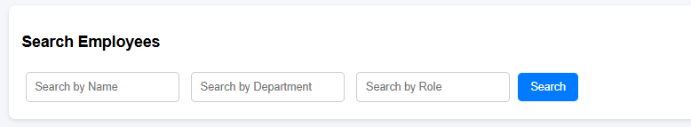

# 🧑‍💼 Employee Management System

A full-stack Employee Management System built using Django that enables efficient management of employee records with secure authentication, role-based access control, and dynamic multi-field filtering.

---

## 🚀 Overview

This project simulates a real-world employee management system used in organizations. It provides a structured dashboard where administrators can manage employee records, while employees have restricted, read-only access.

The system focuses on clean UI, efficient backend logic, and proper role-based access handling.

---

## ✨ Key Features

* 🔐 Secure Authentication (Login / Logout)
* 👑 Role-Based Access Control (Admin & Employee)
* ➕ Add Employee (Admin Only)
* ❌ Delete Employee (Admin Only)
* 👀 View Employees (All Users)
* 🔍 Multi-field Search:

  * Search by Name
  * Search by Department
  * Search by Role
  * Combination of all filters
* 📊 Clean Dashboard with Table View
* ⚡ Efficient Data Handling using Django ORM

---

## 🛠 Tech Stack

* **Backend:** Django (Python)
* **Frontend:** HTML, CSS
* **Database:** SQLite
* **ORM:** Django ORM

---

## 🧠 System Design

* Django handles request-response lifecycle via views
* ORM converts Python queries into SQL
* Templates dynamically render frontend
* Authentication handled using Django’s built-in system
* Role-based logic implemented using `is_staff`

---

## 🔐 User Roles

### 👑 Admin

* Add employee records
* Delete employee records
* View all employees

### 👤 Employee

* View employee records only (read-only access)

---

## 🔍 Search Functionality

* Supports search by **Name**, **Department**, and **Role**
* Allows combining multiple filters
* Case-insensitive matching
* Implemented using Django ORM filtering

---

## 📸 Screenshots

### 🔐 Employee Signup


### 🔐 Employee Login



### 🔐 Admin Login



### 📊 Admin Dashboard



### 👀 Employee Dashboard



### ➕ Add Employee



### 🔍 Filter Employees



---

## ⚙️ Setup Instructions

```bash
# Clone the repository
git clone https://github.com/Adarsh-Beriwala/Employee-Management-System.git

# Navigate into the project
cd Employee-Management-System

# Install dependencies
pip install -r requirements.txt

# Apply migrations
python manage.py migrate

# Run the server
python manage.py runserver
```

---

## 📂 Project Structure

```
employee/
│
├── models.py
├── views.py
├── urls.py
├── templates/
│   ├── login.html
│   ├── employee_signup.html
│   ├── admin_login.html
│   └── home.html
│
├── static/
│
myproject/
│
manage.py
```

---

## 🚀 Future Improvements

* ✏️ Update/Edit Employee Feature
* 📄 Pagination
* 🌐 REST API Integration
* 🚀 Deployment (AWS / Render)
* 📊 Dashboard Analytics

---

## 👨‍💻 Author

**Adarsh Beriwala**

---

## ⭐ Support

If you found this project useful, consider giving it a ⭐ on GitHub.


## ⭐ Support

If you found this project useful, consider giving it a ⭐ on GitHub.
